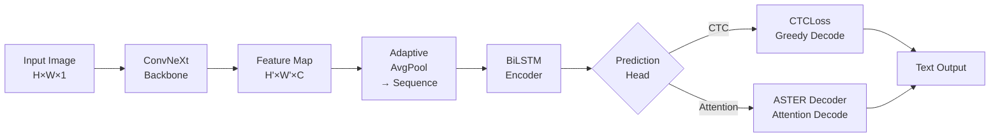
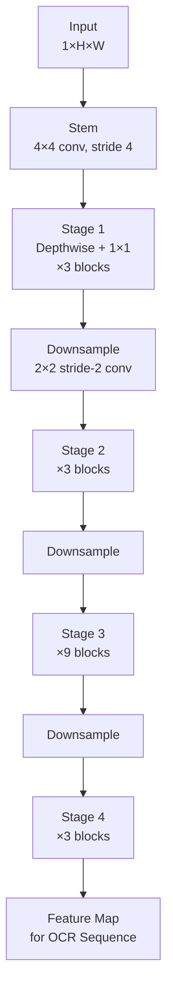
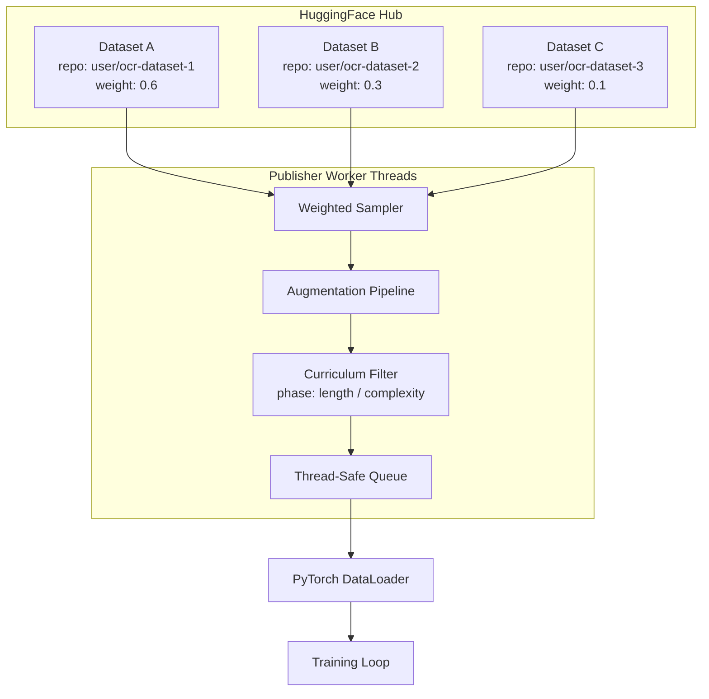
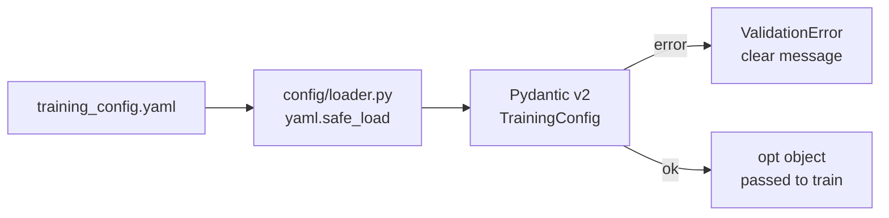
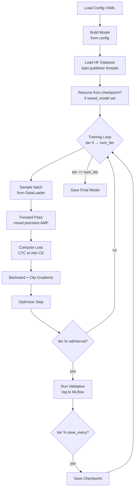
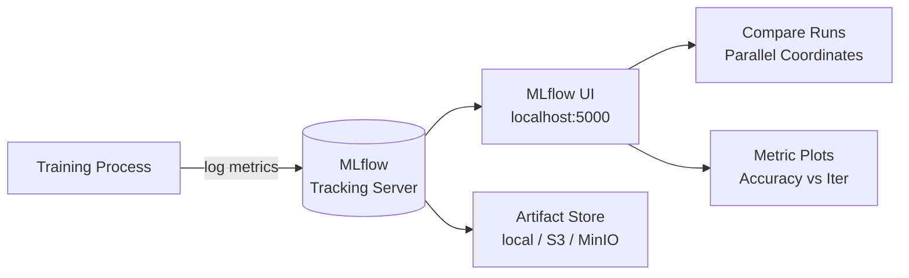
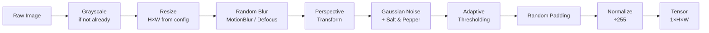

```mermaid
gantt
    title Curriculum Learning Phases
    dateFormat  X
    axisFormat %s

    section Training
    Warmup (short texts, low aug)     :0, 50000
    Medium (mid-length, medium aug)   :50000, 200000
    Full (all lengths, high aug)      :200000, 1000000
```

# OCR-HF — Attention-Based OCR Training Framework on HuggingFace Datasets

<p align="center">
  
  
  
  
  
</p>

> A production-grade, dataset-agnostic OCR training framework powered by  
> **ASTER attention decoding** + **ConvNeXt feature extraction**,  
> using any combination of **HuggingFace Datasets** as data source,  
> with **MLflow** experiment tracking and **curriculum learning** built-in.

---

## Abstract

Training scene-text and document OCR models typically requires large, locally-stored LMDB datasets and brittle data pipelines. This framework eliminates that friction by treating **HuggingFace Hub** as the only data source — multiple datasets can be mixed with configurable weights, streamed on-the-fly, and filtered per curriculum phase, all declared in a single YAML file.

The architecture combines a **ConvNeXt** visual backbone (no TIMM dependency) with a **BiLSTM** sequence encoder and an **ASTER attention decoder**, achieving strong performance on irregular and low-resolution text. A **CTC prediction head** is also available for faster training on clean data.

Everything is fully reproducible: one YAML config = one experiment, tracked end-to-end in **MLflow**.

---

## Table of Contents

1. [Architecture](#1-architecture)
2. [Data Pipeline](#2-data-pipeline)
3. [Configuration System](#3-configuration-system)
4. [Training](#4-training)
5. [Validation & Metrics](#5-validation--metrics)
6. [MLflow Dashboard](#6-mlflow-dashboard)
7. [Augmentation Pipeline](#7-augmentation-pipeline)
8. [Results — v0.1 Baseline](#8-results--v01-baseline)
9. [Implementation Roadmap](#9-implementation-roadmap)
10. [Repository Structure](#10-repository-structure)
11. [Quick Start](#11-quick-start)
12. [Tech Stack](#12-tech-stack)

---

## 1. Architecture

### 1.1 Overview

The model follows the classic **CRNN → ASTER** lineage: a convolutional backbone extracts spatial features, a sequential model builds context over the feature sequence, and a prediction head decodes characters either via CTC (greedy) or attention (beam search / greedy attention).



### 1.2 ConvNeXt Backbone

ConvNeXt is used as the visual feature extractor. This is a **custom implementation with no TIMM dependency**, making the project fully self-contained.



**Key design choices vs. standard ConvNeXt:**
- Input channel = 1 (grayscale images)
- Output adapted for sequence modeling (height collapsed, width = time steps)
- Custom `LayerNorm` and `DropPath` — zero external dependencies
- Configurable via YAML: `convnext_dims`, `convnext_depths`

### 1.3 ASTER Attention Decoder

The ASTER decoder performs **attentional sequence decoding**: at each time step, it attends over the encoded feature sequence to predict the next character.

```mermaid
sequenceDiagram
    participant F as Feature Sequence\n(BiLSTM output)
    participant H as Hidden State h_t
    participant A as Attention\ne_t = f(h_t, F)
    participant C as Context c_t\n(weighted sum)
    participant P as Prediction p_t\n(softmax over vocab)

    loop For each output position t
        H->>A: query h_{t-1}
        F->>A: keys/values
        A->>C: α_t = softmax(e_t)
        C->>P: [c_t ; embed(y_{t-1})] → GRU → FC
        P->>H: update h_t
    end
```

**Training:** teacher forcing with cross-entropy loss  
**Inference:** greedy decoding or beam search  
**EOS token:** explicit end-of-sequence token controls output length

### 1.4 CTC Head (Alternative)

For simpler datasets or faster iteration, a **CTC prediction head** is available. The BiLSTM output is projected directly to vocabulary size and decoded with CTC blank-token algorithm.

```
BiLSTM output (T × B × H)  →  Linear(H → |vocab|+1)  →  CTCLoss / Greedy CTC Decode
```

### 1.5 Model Selection via YAML

```yaml
# Attention model (ASTER)
FeatureExtraction: "ConvNeXt"   # or "ResNet"
SequenceModeling: "BiLSTM"
Prediction: "Attn"              # ASTER attention decoder

# CTC model (faster)
FeatureExtraction: "ConvNeXt"
SequenceModeling: "BiLSTM"
Prediction: "CTC"
```

---

## 2. Data Pipeline

### 2.1 Design Philosophy

Traditional OCR pipelines require converting datasets to LMDB, managing local copies, and writing custom loaders. This framework uses **HuggingFace Hub as the single source of truth**:

- No local dataset copies required
- Multiple datasets mixed with configurable weights
- Streaming mode: images fetched on demand, no full download
- Curriculum learning: per-phase dataset filters and sampling ratios

### 2.2 Multi-Dataset Publisher



### 2.3 Dataset Config (YAML)

Any HuggingFace dataset with an image column and a label column works:

```yaml
datasets:
  - repo_id: "mozilla-foundation/common_voice_11_0"   # example only
    split: "train"
    weight: 1.0
    image_column: "image"
    label_column: "sentence"
    streaming: true
    trust_remote_code: false
```

**Multiple datasets with weights:**
```yaml
datasets:
  - repo_id: "user/printed-text-easy"
    split: "train"
    weight: 0.6
    image_column: "img"
    label_column: "text"
    streaming: true

  - repo_id: "user/handwritten-hard"
    split: "train"
    weight: 0.4
    image_column: "image"
    label_column: "label"
    streaming: true
```

The publisher draws samples proportionally to `weight`, applies augmentation, and feeds the unified DataLoader.

### 2.4 Curriculum Learning Integration

Curriculum learning progressively increases task difficulty across training phases. Each phase can override dataset weights, augmentation intensity, batch size, and learning rate — all in YAML:

```yaml
phases:
  - name: "warmup"
    from_iter: 0
    to_iter: 50000
    batch_size: 32
    lr: 0.0005
    augmentation_level: "low"
    dataset_filter: "lambda sample: len(sample['label']) <= 6"

  - name: "medium"
    from_iter: 50000
    to_iter: 200000
    batch_size: 64
    lr: 0.0002
    augmentation_level: "medium"
    dataset_filter: "lambda sample: len(sample['label']) <= 12"

  - name: "full"
    from_iter: 200000
    to_iter: 1000000
    batch_size: 64
    lr: 0.0001
    augmentation_level: "high"
    dataset_filter: null   # all samples
```



---

## 3. Configuration System

### 3.1 Design

One YAML file fully describes an experiment. Configs are validated with **Pydantic v2** at load time — invalid fields raise errors with clear messages, no silent misconfiguration.



### 3.2 Config Schema Overview

```yaml
# --- Model ---
experiment_name: "convnext-aster-v1"
FeatureExtraction: "ConvNeXt"       # ConvNeXt | ResNet
SequenceModeling: "BiLSTM"
Prediction: "Attn"                   # Attn | CTC
imgH: 32
imgW: 128
input_channel: 1
output_channel: 256
hidden_size: 256
batch_max_length: 25
sensitive: true                      # case-sensitive

# --- Characters ---
character: "0123456789abcdefghijklmnopqrstuvwxyzABCDEFGHIJKLMNOPQRSTUVWXYZ"

# --- Training ---
batch_size: 64
num_iter: 300000
lr: 0.0001
optim: "AdamW"
grad_clip: 5.0
valInterval: 2000
save_every_n_iterations: 10000
checkpoints_dir: "checkpoints/"

# --- Data ---
datasets:
  - repo_id: "your/hf-dataset"
    split: "train"
    weight: 1.0
    image_column: "image"
    label_column: "text"
    streaming: true

val_dataset:
  repo_id: "your/hf-dataset"
  split: "validation"
  image_column: "image"
  label_column: "text"

# --- Curriculum (optional) ---
phases: []   # list of PhaseConfig

# --- MLflow ---
mlflow:
  enabled: true
  tracking_uri: "mlruns/"
  experiment_name: "convnext-aster-v1"
  run_name: "baseline"

# --- Augmentation ---
augmentation:
  enabled: true
  level: "medium"
```

---

## 4. Training

### 4.1 Training Loop Overview



### 4.2 Mixed Precision Training

All forward passes use `torch.amp.autocast` for automatic mixed precision (FP16 compute, FP32 master weights), providing ~1.5–2× speedup on modern GPUs with no accuracy loss.

### 4.3 Curriculum Phase Transitions

The training loop monitors the current iteration and automatically transitions between curriculum phases: updating `batch_size`, `lr`, and the dataset filter applied by the publisher threads — no training restart required.

---

## 5. Validation & Metrics

Metrics are **fully dataset-agnostic** — they work on any text recognition task regardless of domain.

### 5.1 Core Metrics

| Metric | Description |
|--------|-------------|
| **Accuracy** | Exact string match rate (%) |
| **CER** | Character Error Rate — edit distance / ground truth length |
| **Norm. Edit Distance** | 1 − (edit_distance / max(pred_len, gt_len)), higher = better |
| **Validation Loss** | Cross-entropy (Attn) or CTC loss on validation set |

### 5.2 Accuracy by Sequence Length

Groups predictions by ground truth length to reveal where the model struggles:

| Length Group | Description |
|-------------|-------------|
| 1–5 chars | Short tokens |
| 6–10 chars | Medium tokens |
| 11–20 chars | Long tokens |
| 20+ chars | Very long (rare) |

### 5.3 Top-K Character Confusions

Tracks the most frequent `GT char → Predicted char` mistakes, useful for diagnosing systematic errors (e.g., `'m' → 'M'` case confusion, `'O' → '0'` digit/letter ambiguity).

### 5.4 Confidence Calibration

Compares mean confidence for correct vs. incorrect predictions. A well-calibrated model shows a large gap; a collapsed model shows no gap (all outputs get similar scores).

```
Avg confidence (correct):    0.72
Avg confidence (incorrect):  0.18
Calibration gap:             0.54   ← higher is better
```

### 5.5 Validation Output Format

Every validation run writes a structured report to disk AND logs all metrics to MLflow:

```
================================================================================
VALIDATION — Iteration 50000
================================================================================
Accuracy (%):         42.31
Norm. Edit Distance:  0.8412
CER:                  0.1923
Validation Loss:      1.4821
Samples Evaluated:    3000

Accuracy by Length:
  1-5    chars:  68.4%  (1204 samples)
  6-10   chars:  38.2%  (1547 samples)
  11-20  chars:  12.1%  ( 241 samples)
  20+    chars:   0.0%  (   8 samples)

Top-5 Character Confusions:
  1. 'a' → 'o':  312 times
  2. 'l' → '1':  287 times
  3. 'O' → '0':  201 times
  4. 'I' → 'l':  188 times
  5. 'n' → 'm':  144 times
================================================================================
```

---

## 6. MLflow Dashboard

### 6.1 What Gets Tracked

Every training run logs automatically:

| What | MLflow Type |
|------|-------------|
| Full YAML config | Artifact |
| train_loss per 100 iters | Metric |
| grad_norm per 100 iters | Metric |
| learning_rate per 100 iters | Metric |
| Accuracy (%) per valInterval | Metric |
| CER per valInterval | Metric |
| Norm. Edit Distance per valInterval | Metric |
| Validation Loss per valInterval | Metric |
| Validation report .txt | Artifact |
| Best model checkpoint path | Tag |

### 6.2 Dashboard Setup



**Local setup (SQLite, zero infrastructure):**
```bash
bash scripts/start_mlflow.sh
# → http://localhost:5000
```

**Docker setup (PostgreSQL + MinIO artifact store):**
```bash
docker-compose -f docker/mlflow/docker-compose.yml up
# → http://localhost:5000
```

### 6.3 Key Charts to Watch

```
Accuracy (%) vs Iteration
─────────────────────────────────────────────────────────
  60% ┤                                         ╭─────
  50% ┤                              ╭──────────╯
  40% ┤                    ╭─────────╯
  30% ┤          ╭─────────╯
  20% ┤ ╭────────╯
  10% ┤─╯
      └────────────────────────────────────────────────
      0    50k   100k  200k  300k  400k  500k  iter

CER vs Iteration (lower is better)
─────────────────────────────────────────────────────────
  0.9 ┤─╮
  0.7 ┤ ╰──╮
  0.5 ┤    ╰────╮
  0.3 ┤         ╰──────╮
  0.2 ┤                ╰──────────────────────────────
      └────────────────────────────────────────────────
      0    50k   100k  200k  300k  400k  500k  iter
```

---

## 7. Augmentation Pipeline

Augmentation is applied in the **publisher threads** before batches reach the training loop. All parameters are YAML-configurable and can be overridden per curriculum phase.

### 7.1 Pipeline Stages



### 7.2 Augmentation Levels

| Level | Blur | Perspective | Noise | Thresholding | Use Case |
|-------|------|-------------|-------|--------------|----------|
| `off` | — | — | — | — | Validation / clean data |
| `low` | 0.1 | 0.05 | 0.1 | 0.1 | Curriculum warmup |
| `medium` | 0.3 | 0.2 | 0.3 | 0.2 | Mid training |
| `high` | 0.5 | 0.4 | 0.5 | 0.4 | Hard examples |

---

## 8. Results — v0.1 Baseline

> **Dataset:** [`jlbaker361/new_iiit5k_words`](https://huggingface.co/datasets/jlbaker361/new_iiit5k_words) — 6,000 word images from real-world scene text, 62-char vocabulary.  
> **Architecture:** ConvNeXt + BiLSTM + ASTER Attention  
> **Hardware:** single GPU  
> **Training:** 50,000 iterations, batch size 32, lr 1e-4

*Results will be filled in after v0.1 training run completes.*

| Metric | v0.1 |
|--------|------|
| Accuracy (%) | — |
| CER | — |
| Norm. Edit Distance | — |
| Training iterations | — |
| Best checkpoint | — |

---

## 9. Implementation Roadmap

> **Legend:** ✅ Done · 🔄 In Progress · ⬜ Pending

---

### PHASE 0 — Repository Bootstrap

- [x] **0.1** Create repository, git init, initial commit
- [ ] **0.2** Write `requirements.txt` (torch, datasets, transformers, mlflow, pydantic, albumentations, editdistance, Pillow, pyyaml)
- [ ] **0.3** Write `pyproject.toml` — pip-installable package `chord_ocr`
- [ ] **0.4** Add `.env.example` — document all env variables (HF_TOKEN, MLFLOW_TRACKING_URI, etc.)
- [ ] **0.5** Set up `pre-commit` hooks — black, isort, mypy
- [ ] **0.6** Add GitHub Actions: `test.yml` and `lint.yml`
- [ ] **0.7** Add as git submodule in parent private repository

---

### PHASE 1 — Architecture Extraction

> Extract ASTER + ConvNeXt from private repo. Clean, no binary classifier, no TrOCR, no R&D.

#### 1.1 ConvNeXt Backbone
- [ ] **1.1.1** `ocr_hf/architecture/convnext/model.py` — ConvNeXt with LayerNorm, DropPath, custom dims
- [ ] **1.1.2** `ocr_hf/architecture/convnext/feature_extractor.py` — OCR-adapted feature extractor
- [ ] **1.1.3** Remove all LMDB/Redis/private imports, make self-contained
- [ ] **1.1.4** `tests/test_convnext.py` — forward pass with dummy tensor `(B, 1, 32, 128)`

#### 1.2 ASTER Attention Decoder
- [ ] **1.2.1** `ocr_hf/architecture/aster/model.py` — full ASTER model
- [ ] **1.2.2** `ocr_hf/architecture/aster/encoder.py` — BiLSTM encoder
- [ ] **1.2.3** `ocr_hf/architecture/aster/decoder.py` — attention decoder with GRU
- [ ] **1.2.4** `ocr_hf/architecture/aster/attention.py` — attention mechanism
- [ ] **1.2.5** `tests/test_aster.py` — end-to-end forward pass, CTC and Attn heads

#### 1.3 ResNet Backbone (alternative)
- [ ] **1.3.1** `ocr_hf/architecture/feature_extraction.py` — ResNet only (no VGG)
- [ ] **1.3.2** `tests/test_resnet.py`

#### 1.4 BiLSTM Sequence Modeling
- [ ] **1.4.1** `ocr_hf/architecture/sequence_modeling.py`
- [ ] **1.4.2** Unit test: correct output shape `(T, B, 2*hidden)`

#### 1.5 Unified Model Factory
- [ ] **1.5.1** `ocr_hf/architecture/model.py` — `ModelFactory.from_config(opt)`
  - Supports: ConvNeXt/ResNet × BiLSTM × Attn/CTC
  - Removes: TrOCR, experimental models
- [ ] **1.5.2** Integration test: build every combination from config, run forward pass

---

### PHASE 2 — Configuration System

- [ ] **2.1** `ocr_hf/config/schema.py` — Pydantic v2 schemas:
  - `TrainingConfig`, `DatasetSourceConfig`, `PhaseConfig`, `MLflowConfig`, `AugmentationConfig`
- [ ] **2.2** `ocr_hf/config/loader.py` — YAML loader with env var substitution and config inheritance
- [ ] **2.3** `configs/training/convnext_aster_base.yaml` — baseline config
- [ ] **2.4** `configs/training/resnet_ctc_fast.yaml` — fast lightweight config
- [ ] **2.5** `configs/training/curriculum_3phase.yaml` — 3-phase curriculum example
- [ ] **2.6** `configs/datasets/single_hf.yaml` — single HF dataset
- [ ] **2.7** `configs/datasets/multi_hf_weighted.yaml` — multi-dataset with weights
- [ ] **2.8** Unit tests: valid config loads, unknown field raises error, required field missing raises error

---

### PHASE 3 — HuggingFace Data Pipeline

#### 3.1 Multi-Dataset Publisher
- [ ] **3.1.1** `ocr_hf/data/publisher/hf_publisher.py`
  - Loads N HF datasets from config array
  - Weighted sampling across datasets (no local copy, streaming)
  - Feeds batches to thread-safe queue
- [ ] **3.1.2** `ocr_hf/data/publisher/image_processing.py` — resize, grayscale, normalize
- [ ] **3.1.3** `ocr_hf/data/publisher/curriculum_learning.py` — phase-based sample filtering
- [ ] **3.1.4** `ocr_hf/data/publisher/thread_workers.py` — producer threads, queue management

#### 3.2 PyTorch Dataset & DataLoader
- [ ] **3.2.1** `ocr_hf/data/hf_dataset.py` — `HFOCRDataset(IterableDataset)` wrapping publisher queue
- [ ] **3.2.2** `ocr_hf/data/align_collate.py` — pad images to uniform H×W per batch
- [ ] **3.2.3** `ocr_hf/data/sampler.py` — `CurriculumSampler` for non-streaming mode

#### 3.3 Augmentation Pipeline
- [ ] **3.3.1** `ocr_hf/data/augmentations/pipeline.py` — build from YAML level config
- [ ] **3.3.2** `ocr_hf/data/augmentations/transforms.py` — blur, perspective, noise, rotation, thresholding, padding
- [ ] **3.3.3** `tests/test_augmentation.py` — no crash on edge-case images, output shape correct

#### 3.4 v0.1 Target Dataset
- [ ] **3.4.1** Validate pipeline works end-to-end on [`jlbaker361/new_iiit5k_words`](https://huggingface.co/datasets/jlbaker361/new_iiit5k_words)
- [ ] **3.4.2** `configs/datasets/iiit5k_v01.yaml` — ready-to-use config for this dataset
- [ ] **3.4.3** `tests/test_iiit5k_pipeline.py` — load 10 batches, check shapes and label lengths

---

### PHASE 4 — Training Pipeline

- [ ] **4.1** `ocr_hf/train/utils.py` — `CTCLabelConverter`, `AttnLabelConverter`, `Averager`
- [ ] **4.2** `ocr_hf/train/forward_pass.py` — mixed precision AMP forward + loss (CTC / Attn CE)
- [ ] **4.3** `ocr_hf/train/gradient_monitor.py` — per-layer gradient norm logging to MLflow
- [ ] **4.4** `ocr_hf/train/train.py` — main training loop:
  - HF DataLoader (replaces LMDB/Redis)
  - Curriculum phase management
  - Checkpoint save/load
  - Best model tracking (accuracy + norm_ed)
  - MLflow logging at every `val_interval`
- [ ] **4.5** `ocr_hf/train/run.py` — CLI: `python -m ocr_hf.train.run --config configs/...`
- [ ] **4.6** `tests/test_forward_pass.py` — CTC and Attn forward with dummy data, loss computes correctly
- [ ] **4.7** `tests/test_label_converters.py` — encode/decode round-trip for both converters

---

### PHASE 5 — Validation & Metrics

- [ ] **5.1** `ocr_hf/train/validation.py` — validation loop over HF val split, returns metric dict
- [ ] **5.2** `ocr_hf/train/metrics.py` — dataset-agnostic metric classes:
  - `ExactMatchAccuracy`
  - `CharacterErrorRate`
  - `NormEditDistance`
  - `AccuracyByLength`
  - `TopKCharacterConfusions`
  - `ConfidenceCalibration`
- [ ] **5.3** `ocr_hf/train/validation_logger.py` — write structured report to file + MLflow artifact
- [ ] **5.4** `tests/test_metrics.py` — all metric classes with known inputs/outputs

---

### PHASE 6 — MLflow Integration

- [ ] **6.1** `ocr_hf/monitoring/mlflow_tracker.py` — `ExperimentTracker` class:
  - `log_training_step(iter, loss, grad_norm, lr)`
  - `log_validation(iter, metrics_dict)`
  - `log_config(opt)` — YAML as artifact
  - `log_validation_report(iter, report_path)`
- [ ] **6.2** Add `MLflowConfig` to Pydantic schema (Phase 2.1)
- [ ] **6.3** `scripts/start_mlflow.sh` and `scripts/start_mlflow.bat`
- [ ] **6.4** `docker/mlflow/docker-compose.yml` — MLflow + PostgreSQL + MinIO
- [ ] **6.5** `docs/mlflow_guide.md` — setup, key charts, how to compare runs
- [ ] **6.6** End-to-end test: run 100 iters, check MLflow run has expected metrics logged

---

### PHASE 7 — v0.1 Training Run & Results

- [ ] **7.1** Train baseline on `jlbaker361/new_iiit5k_words`, 50k iters, ConvNeXt+ASTER+Attn
- [ ] **7.2** Fill in Results table in Section 8 of this README
- [ ] **7.3** Add MLflow screenshot to `docs/` and reference in README
- [ ] **7.4** Save best checkpoint, upload to HuggingFace Hub under `models/` in dataset repo
- [ ] **7.5** Tag release `v0.1.0`

---

### PHASE 8 — CI/CD & Release

- [ ] **8.1** `.github/workflows/test.yml` — pytest on push to main
- [ ] **8.2** `.github/workflows/lint.yml` — black + isort + mypy
- [ ] **8.3** `CONTRIBUTING.md`
- [ ] **8.4** `CHANGELOG.md`
- [ ] **8.5** `v0.1.0` release — baseline working end-to-end on IIIT5K
- [ ] **8.6** `v0.2.0` release — multi-dataset + curriculum learning
- [ ] **8.7** `v1.0.0` release — full pipeline stable, MLflow, docs complete

---

## 10. Repository Structure

```
ocr-hf/
├── ocr_hf/
│   ├── architecture/
│   │   ├── model.py                  # ModelFactory.from_config(opt)
│   │   ├── feature_extraction.py     # ResNet backbone
│   │   ├── sequence_modeling.py      # BiLSTM
│   │   ├── convnext/
│   │   │   ├── model.py              # ConvNeXt (no TIMM)
│   │   │   └── feature_extractor.py  # OCR-adapted
│   │   └── aster/
│   │       ├── model.py
│   │       ├── encoder.py
│   │       ├── decoder.py
│   │       └── attention.py
│   ├── config/
│   │   ├── schema.py                 # Pydantic v2 DTOs
│   │   └── loader.py                 # YAML loader
│   ├── data/
│   │   ├── hf_dataset.py             # HFOCRDataset (IterableDataset)
│   │   ├── align_collate.py          # Batch collation
│   │   ├── sampler.py                # CurriculumSampler
│   │   ├── augmentations/
│   │   │   ├── pipeline.py           # Build from YAML
│   │   │   └── transforms.py         # All transforms
│   │   └── publisher/
│   │       ├── hf_publisher.py       # Multi-HF-dataset publisher
│   │       ├── image_processing.py
│   │       ├── curriculum_learning.py
│   │       └── thread_workers.py
│   ├── train/
│   │   ├── run.py                    # CLI entry point
│   │   ├── train.py                  # Training loop
│   │   ├── forward_pass.py           # AMP forward + loss
│   │   ├── validation.py             # Validation loop
│   │   ├── metrics.py                # Agnostic metric classes
│   │   ├── validation_logger.py      # Report writer
│   │   ├── gradient_monitor.py       # Gradient health
│   │   └── utils.py                  # Label converters
│   └── monitoring/
│       └── mlflow_tracker.py         # ExperimentTracker
├── configs/
│   ├── training/
│   │   ├── convnext_aster_base.yaml
│   │   ├── resnet_ctc_fast.yaml
│   │   └── curriculum_3phase.yaml
│   └── datasets/
│       ├── iiit5k_v01.yaml           # v0.1 target dataset
│       ├── single_hf.yaml
│       └── multi_hf_weighted.yaml
├── tests/
│   ├── test_convnext.py
│   ├── test_aster.py
│   ├── test_hf_publisher.py
│   ├── test_curriculum_sampler.py
│   ├── test_align_collate.py
│   ├── test_forward_pass.py
│   ├── test_label_converters.py
│   ├── test_metrics.py
│   └── test_iiit5k_pipeline.py
├── scripts/
│   ├── start_mlflow.sh
│   └── start_mlflow.bat
├── docker/
│   └── mlflow/
│       └── docker-compose.yml
├── docs/
│   ├── architecture.md
│   ├── training_guide.md
│   ├── dataset_guide.md
│   ├── curriculum_learning.md
│   └── mlflow_guide.md
├── .github/
│   └── workflows/
│       ├── test.yml
│       └── lint.yml
├── requirements.txt
├── pyproject.toml
├── .env.example
├── .gitignore
├── CONTRIBUTING.md
├── CHANGELOG.md
└── README.md
```

---

## 11. Quick Start

```bash
git clone https://github.com/YOUR_USERNAME/ocr-hf
cd ocr-hf
pip install -r requirements.txt

# Train on IIIT5K (v0.1 baseline)
python -m ocr_hf.train.run --config configs/training/convnext_aster_base.yaml

# Launch MLflow dashboard
bash scripts/start_mlflow.sh
# open http://localhost:5000

# Run tests
pytest tests/
```

---

## 12. Tech Stack

| Component | Technology |
|-----------|------------|
| Deep Learning | PyTorch 2.x |
| Architectures | ASTER (custom), ConvNeXt (custom, no TIMM) |
| Data | HuggingFace `datasets` — streaming, multi-source |
| Augmentation | Albumentations + custom transforms |
| Configuration | YAML + Pydantic v2 |
| Experiment Tracking | MLflow |
| CI/CD | GitHub Actions |
| Containers | Docker Compose (MLflow + PostgreSQL + MinIO) |
| Packaging | `pyproject.toml` |

---

## License

MIT — see [LICENSE](LICENSE)

---

*Production-grade OCR training framework. Architecture adapted from ASTER (Shi et al., 2018) and ConvNeXt (Liu et al., 2022).*
