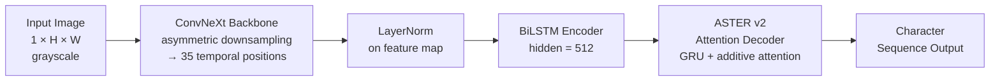
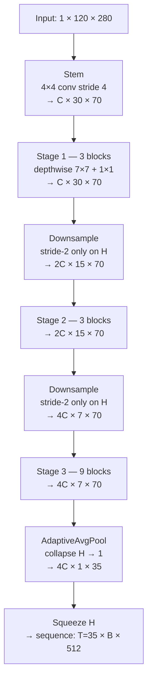
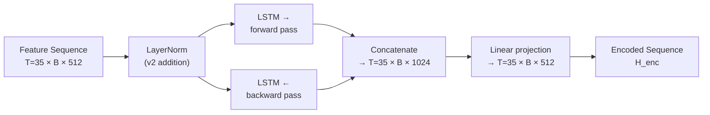
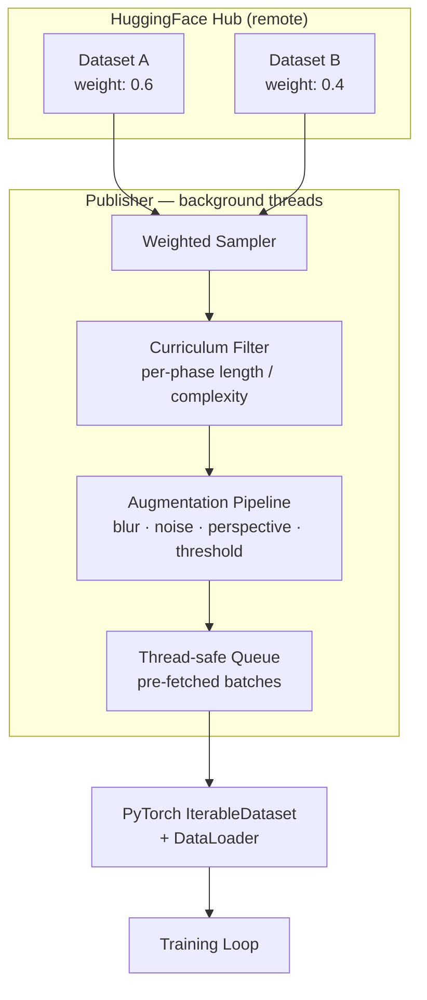
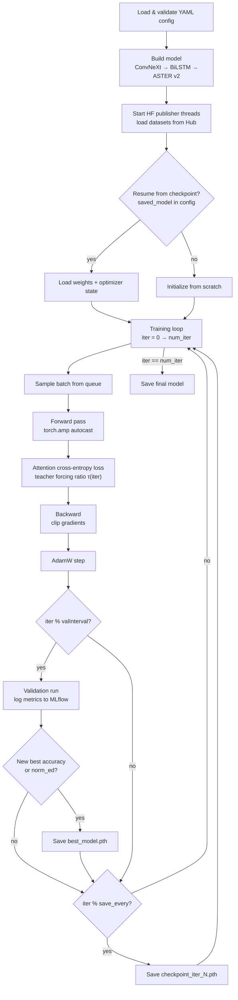
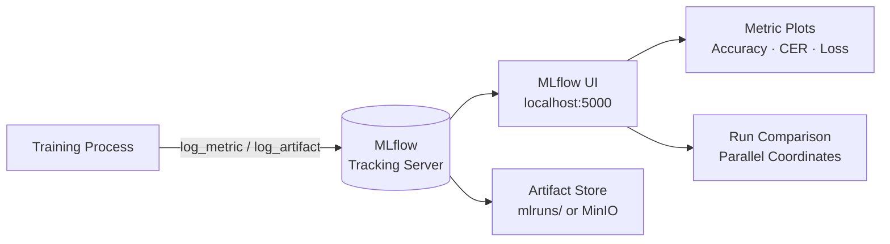
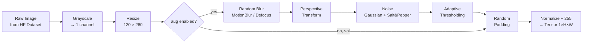

# OCR-Aster-ConvNeXt-Trainer

<p align="center">
  
  
  
  
  
</p>

> A focused, production-grade OCR training framework built around a **single, specific architecture**:  
> **ConvNeXt → BiLSTM → ASTER Attention Decoder (v2)**,  
> trained on any **HuggingFace Dataset** with **MLflow** experiment tracking  
> and **curriculum learning** built-in.

This is not a benchmark suite or a pluggable multi-architecture library.  
It is one carefully designed model, trained well.

---

## Abstract

Most OCR training repositories ship dozens of interchangeable architectures behind a plugin system, making them hard to understand and harder to trust. This project does the opposite: it exposes **one model** — a refined ASTER v2 with a ConvNeXt backbone — and implements it cleanly from top to bottom.

The architecture combines:
- A **ConvNeXt** visual backbone in OCR mode (asymmetric downsampling → 35 temporal positions)
- A **LayerNorm-gated BiLSTM** encoder
- An **ASTER v2 attention decoder** with encoder→decoder bridge initialization and scheduled teacher-forcing decay

Data comes exclusively from **HuggingFace Hub** — multiple datasets can be mixed with configurable weights, streamed without local copies, and filtered per curriculum phase. Everything is declared in a single YAML file and tracked in **MLflow**.

---

## Table of Contents

1. [Architecture](#1-architecture)
2. [Data Pipeline](#2-data-pipeline)
3. [Configuration System](#3-configuration-system)
4. [Training](#4-training)
5. [Validation & Metrics](#5-validation--metrics)
6. [MLflow Dashboard](#6-mlflow-dashboard)
7. [Augmentation Pipeline](#7-augmentation-pipeline)
8. [Results — v0.1 Baseline](#8-results--v01-baseline)
9. [Implementation Roadmap](#9-implementation-roadmap)
10. [Repository Structure](#10-repository-structure)
11. [Quick Start](#11-quick-start)
12. [Tech Stack](#12-tech-stack)

---

## 1. Architecture

### 1.1 The Full Forward Pass

One image goes in. A character sequence comes out. There are no branches, no switches, no optional heads.



**Fixed hyperparameters (not configurable — this is the model):**

| Parameter | Value |
|-----------|-------|
| Input | Grayscale, 1 channel |
| Image size | 120 × 280 (H × W) |
| ConvNeXt output channels | 512 |
| BiLSTM hidden size | 512 |
| Sequence positions (T) | 35 (asymmetric downsampling) |
| Max output length | 28 characters |
| Attention type | Additive (Bahdanau-style) |
| Teacher forcing | Scheduled decay 1.0 → 0.3 over 300k iters |

---

### 1.2 ConvNeXt Backbone — OCR Mode

Standard ConvNeXt downsamples symmetrically (H and W equally). For OCR, characters are arranged horizontally — we need **many temporal positions along the width** while compressing height aggressively.

**ASTER v2 modification:** asymmetric stride configuration that yields **35 temporal positions** from a 280px-wide input (vs. ~8 with standard settings).



**Key property:** width is never aggressively downsampled — the model preserves horizontal resolution to separate individual characters.

Custom `LayerNorm` and `DropPath` are implemented directly in the module. **No TIMM dependency.**

---

### 1.3 BiLSTM Encoder

The feature sequence `(T=35, B, 512)` passes through a 2-layer BiLSTM that builds contextual representations by reading the sequence left-to-right **and** right-to-left simultaneously.



**v2 addition:** LayerNorm is applied to the feature map **before** it enters the BiLSTM. This stabilizes gradient flow and was a measurable improvement over the v1 baseline.

---

### 1.4 ASTER v2 Attention Decoder

The decoder generates one character at a time. At each step it **attends over the full encoded sequence** to decide which visual region to look at, then updates its internal state and predicts the next character.

```mermaid
sequenceDiagram
    participant E as Encoded Sequence\nH_enc (T=35)
    participant G as GRU Hidden State\nh_t
    participant A as Additive Attention\ne_ti = v·tanh(W_h·h + W_e·H_enc_i)
    participant C as Context Vector\nc_t = Σ α_ti · H_enc_i
    participant P as Prediction\np_t = softmax(FC([c_t ; embed(y_{t-1})]))

    loop t = 0 → max_length
        G->>A: query h_{t-1}
        E->>A: keys H_enc
        A->>C: α_t = softmax(e_t)
        C->>P: predict char at position t
        P->>G: update GRU: h_t = GRU([c_t ; embed(y_{t-1})], h_{t-1})
    end
```

**v2 improvements over v1:**

| Improvement | v1 | v2 |
|-------------|----|----|
| Decoder init | zeros | encoder final state (bridge) |
| Teacher forcing | fixed 1.0 | scheduled decay 1.0 → 0.3 |
| LayerNorm | absent | before BiLSTM |
| Temporal positions | ~8 | 35 (asymmetric downsampling) |
| Encoder projection cache | recomputed each step | cached once per sequence |

**Encoder→Decoder bridge:** instead of initializing the GRU hidden state to zeros, the last hidden state of the BiLSTM encoder is projected and used as the decoder's initial state. This gives the decoder a "warm start" with a global summary of the input.

**Scheduled sampling:** teacher forcing ratio `τ` decays linearly from 1.0 to 0.3 over 300k iterations. Early in training, the decoder always receives the ground-truth previous character (`τ=1`). Later, it increasingly receives its own previous prediction (`τ→0.3`), closing the train/inference gap.

```
Teacher Forcing Ratio τ
─────────────────────────────────────────────────────
  1.0 ┤╲
  0.8 ┤  ╲
  0.6 ┤    ╲
  0.4 ┤      ╲
  0.3 ┤        ─────────────────────────────────────
      └────────────────────────────────────────────
      0       100k     200k     300k     → iter
```

---

## 2. Data Pipeline

### 2.1 Design

No local dataset copies. No LMDB. No Redis. **HuggingFace Hub is the only data source.**

Multiple datasets are mixed with configurable weights, streamed on demand, augmented in background threads, and filtered per curriculum phase — all declared in YAML.



### 2.2 Dataset Config

Any HuggingFace dataset with an image column and a text label column works:

```yaml
datasets:
  - repo_id: "user/my-ocr-dataset"
    split: "train"
    weight: 1.0
    image_column: "image"
    label_column: "text"
    streaming: true

val_dataset:
  repo_id: "user/my-ocr-dataset"
  split: "validation"
  image_column: "image"
  label_column: "text"
```

**Multiple datasets with weights:**
```yaml
datasets:
  - repo_id: "user/easy-printed-text"
    split: "train"
    weight: 0.6
    image_column: "img"
    label_column: "label"
    streaming: true

  - repo_id: "user/hard-handwritten"
    split: "train"
    weight: 0.4
    image_column: "image"
    label_column: "text"
    streaming: true
```

### 2.3 Curriculum Learning

Training progresses through phases of increasing difficulty. Each phase controls batch size, learning rate, augmentation intensity, and a sample filter — all in YAML, no code changes needed.

```mermaid
gantt
    title Curriculum Learning Phases (example)
    dateFormat  X
    axisFormat  %s

    section Difficulty
    Phase 1 — short texts, low augmentation   :0, 116000
    Phase 2 — medium texts, low+              :116000, 160000
    Phase 3 — medium aug, blur effects        :160000, 245000
    Phase 4 — high aug, optical distortions   :245000, 500000
    Phase 5 — high, extended length           :500000, 700000
    Phase 6 — all lengths, full pipeline      :700000, 1000000
```



```yaml
phases:
  - name: "phase_1"
    from_iter: 0
    to_iter: 50000
    batch_size: 32
    lr: 0.0001625
    augmentation_level: "low"
    dataset_filter: "lambda s: len(s['label']) <= 6"

  - name: "phase_2"
    from_iter: 50000
    to_iter: 200000
    batch_size: 32
    lr: 0.0001
    augmentation_level: "medium"
    dataset_filter: "lambda s: len(s['label']) <= 12"
```

---

## 3. Configuration System

One YAML file = one experiment. All fields are validated at startup with **Pydantic v2** — unknown fields raise errors, required fields are documented.

```yaml
# ── Experiment ──────────────────────────────────────────
experiment_name: "aster-v2-run1"

# ── Model (fixed architecture, only these params vary) ──
imgH: 120
imgW: 280
input_channel: 1
output_channel: 512
hidden_size: 512
batch_max_length: 28
sensitive: true
character: "0123456789abcdefghijklmnopqrstuvwxyzABCDEFGHIJKLMNOPQRSTUVWXYZ#()+,-_/"

# ── Scheduled Sampling ───────────────────────────────────
tf_start: 1.0
tf_end: 0.3
tf_decay_iters: 300000

# ── Training ─────────────────────────────────────────────
batch_size: 32
num_iter: 300000
lr: 0.0001625
weight_decay: 0.02
optim: "AdamW"
grad_clip: 1.0
valInterval: 25000
save_every_n_iterations: 10000
checkpoints_dir: "checkpoints/"
saved_model: ""   # path to resume from

# ── Data ─────────────────────────────────────────────────
datasets:
  - repo_id: "jlbaker361/new_iiit5k_words"
    split: "train"
    weight: 1.0
    image_column: "image"
    label_column: "label"
    streaming: true

val_dataset:
  repo_id: "jlbaker361/new_iiit5k_words"
  split: "test"
  image_column: "image"
  label_column: "label"

# ── Curriculum (optional) ────────────────────────────────
phases: []

# ── Augmentation ─────────────────────────────────────────
augmentation:
  enabled: true
  level: "medium"

# ── MLflow ───────────────────────────────────────────────
mlflow:
  enabled: true
  tracking_uri: "mlruns/"
  experiment_name: "aster-v2-run1"
  run_name: "baseline"
```

---

## 4. Training

### 4.1 Training Loop



### 4.2 Loss Function

Attention cross-entropy loss with teacher forcing:

```
At each decoding step t:
  - with probability τ(iter): feed ground-truth y_{t-1}   ← teacher forcing
  - with probability 1-τ(iter): feed model's prediction ŷ_{t-1}  ← free running

Loss = CrossEntropy(logits, targets)  summed over all positions and batch
```

Teacher forcing ratio at iteration `i`:
```
τ(i) = tf_start - (tf_start - tf_end) × min(i / tf_decay_iters, 1.0)
```

### 4.3 Mixed Precision

All forward passes use `torch.amp.autocast` (FP16 compute, FP32 master weights). Provides ~1.5–2× speedup on modern GPUs with no accuracy loss. Gradient scaling handles FP16 underflow.

---

## 5. Validation & Metrics

All metrics are **dataset-agnostic** — they measure text recognition quality regardless of domain.

### 5.1 Core Metrics

| Metric | Formula | Notes |
|--------|---------|-------|
| **Accuracy** | exact matches / total | Case-sensitive |
| **CER** | edit_dist(pred, gt) / len(gt) | Character Error Rate, lower = better |
| **Norm. Edit Distance** | 1 − edit_dist / max(len(pred), len(gt)) | Higher = better |
| **Validation Loss** | CE loss on val set | Direct training signal |

### 5.2 Accuracy by Sequence Length

Reveals where the model struggles — short sequences are almost always learned first.

| Group | Length Range |
|-------|-------------|
| Short | 1 – 5 chars |
| Medium | 6 – 10 chars |
| Long | 11 – 20 chars |
| Very long | 20+ chars |

### 5.3 Top-K Character Confusions

Tracks the most frequent `GT → Predicted` character mistakes. Useful for diagnosing systematic errors: digit/letter ambiguity (`0`/`O`), case errors (`m`/`M`), similar glyphs (`l`/`1`/`I`).

### 5.4 Confidence Calibration

```
Avg confidence when correct:   0.72
Avg confidence when wrong:     0.18
Calibration gap:               0.54   ← higher = model knows when it's wrong
```

### 5.5 Validation Report Format

Every validation writes a structured `.txt` report to disk **and** logs all metrics to MLflow as artifacts:

```
================================================================================
VALIDATION — Iteration 50000
================================================================================
Accuracy (%):          42.31
Norm. Edit Distance:   0.8412
CER:                   0.1923
Validation Loss:       1.4821
Samples Evaluated:     3000

Accuracy by Length:
  1-5    chars:  68.4%  (1204 samples)
  6-10   chars:  38.2%  (1547 samples)
  11-20  chars:  12.1%  ( 241 samples)
  20+    chars:   0.0%  (   8 samples)

Top-5 Character Confusions:
  1. 'a' → 'o':  312 times
  2. 'l' → '1':  287 times
  3. 'O' → '0':  201 times
  4. 'I' → 'l':  188 times
  5. 'n' → 'm':  144 times

Sample Predictions:
  GT: "hello"     Pred: "hello"     ✓ conf: 0.84
  GT: "world"     Pred: "w0rld"     ✗ conf: 0.41
  GT: "OpenAI"    Pred: "OpenAI"    ✓ conf: 0.77
================================================================================
```

---

## 6. MLflow Dashboard

### 6.1 What Gets Logged

| What | Type | When |
|------|------|------|
| Full YAML config | Artifact | Run start |
| `train/loss` | Metric | Every 100 iters |
| `train/grad_norm` | Metric | Every 100 iters |
| `train/learning_rate` | Metric | Every 100 iters |
| `train/teacher_forcing_ratio` | Metric | Every 100 iters |
| `val/accuracy` | Metric | Every `valInterval` |
| `val/cer` | Metric | Every `valInterval` |
| `val/norm_edit_distance` | Metric | Every `valInterval` |
| `val/loss` | Metric | Every `valInterval` |
| Validation report `.txt` | Artifact | Every `valInterval` |
| Best checkpoint path | Tag | On new best |

### 6.2 Setup



**Local — zero infrastructure (SQLite):**
```bash
bash scripts/start_mlflow.sh
# → open http://localhost:5000
```

**Docker — persistent (PostgreSQL + MinIO):**
```bash
docker-compose -f docker/mlflow/docker-compose.yml up
# → open http://localhost:5000
```

### 6.3 Key Charts

```
Accuracy (%) vs Iteration
───────────────────────────────────────────────────────
  60% ┤                                       ╭───────
  50% ┤                            ╭──────────╯
  40% ┤                 ╭──────────╯
  30% ┤       ╭─────────╯
  20% ┤╭──────╯
      └───────────────────────────────────────────────
      0     50k    100k   200k   300k   400k   500k

CER vs Iteration (lower is better)
───────────────────────────────────────────────────────
  0.8 ┤╮
  0.6 ┤╰──╮
  0.4 ┤   ╰────╮
  0.2 ┤        ╰──────────────────────────────────────
      └───────────────────────────────────────────────
      0     50k    100k   200k   300k   400k   500k

Teacher Forcing Ratio τ (scheduled decay)
───────────────────────────────────────────────────────
  1.0 ┤╲
  0.7 ┤  ╲
  0.5 ┤    ╲
  0.3 ┤      ────────────────────────────────────────
      └───────────────────────────────────────────────
      0       100k      200k      300k →
```

---

## 7. Augmentation Pipeline

Applied in publisher threads before batches reach the GPU. Parameters are controlled by `augmentation_level` in YAML (or per curriculum phase).



### Augmentation Levels

| Level | Blur | Perspective | Noise | Threshold | LCD artifacts (STRAug) |
|-------|------|-------------|-------|-----------|------------------------|
| `off` | — | — | — | — | — |
| `low` | 0.1 | 0.05 | 0.1 | 0.1 | Grid, JPEG compression |
| `medium` | 0.3 | 0.2 | 0.3 | 0.2 | + VGrid, MotionBlur, Defocus |
| `high` | 0.5 | 0.4 | 0.5 | 0.4 | + HGrid, RectGrid, Pixelate, OpticalDistortion |
| `all` | 0.6 | 0.5 | 0.6 | 0.5 | All of the above |

---

## 8. Results — v0.1 Baseline

> **Dataset:** [`jlbaker361/new_iiit5k_words`](https://huggingface.co/datasets/jlbaker361/new_iiit5k_words)  
> 6,000 cropped word images from real-world scene text. 62-character vocabulary.  
> **Architecture:** ConvNeXt → BiLSTM → ASTER v2 Attention  
> **Config:** `configs/training/aster_v2_iiit5k.yaml`

*Results will be populated after the v0.1 training run completes.*

| Metric | v0.1 |
|--------|------|
| Accuracy (%) | — |
| CER | — |
| Norm. Edit Distance | — |
| Best iteration | — |
| Training time | — |

---

## 9. Implementation Roadmap

> **Legend:** ✅ Done · 🔄 In Progress · ⬜ Pending

---

### PHASE 0 — Repository Bootstrap

- [x] **0.1** Create repository, git init, initial commit, push to GitHub
- [ ] **0.2** `requirements.txt` — torch, datasets, mlflow, pydantic, albumentations, editdistance, pyyaml, Pillow
- [ ] **0.3** `pyproject.toml` — pip-installable package `ocr_aster`
- [ ] **0.4** `.env.example` — HF_TOKEN, MLFLOW_TRACKING_URI, checkpoints dir
- [ ] **0.5** `pre-commit` config — black, isort, mypy
- [ ] **0.6** GitHub Actions: `test.yml` (pytest) + `lint.yml` (black + isort + mypy)
- [ ] **0.7** Add as git submodule in parent private repo

---

### PHASE 1 — Model: ConvNeXt Backbone

- [ ] **1.1** `ocr_aster/model/convnext.py`
  - Asymmetric downsampling: stride on H only after stem, preserve W → 35 temporal positions
  - Custom `LayerNorm` (no TIMM)
  - Custom `DropPath`
  - Input: `(B, 1, 120, 280)` → Output: `(T=35, B, 512)`
- [ ] **1.2** `tests/test_convnext.py`
  - Forward pass with dummy tensor, assert output shape `(35, B, 512)`
  - Verify no TIMM import anywhere in module

---

### PHASE 2 — Model: BiLSTM Encoder

- [ ] **2.1** `ocr_aster/model/encoder.py`
  - Input: `(T=35, B, 512)`
  - `LayerNorm` applied **before** LSTM (v2 addition)
  - 2-layer BiLSTM, hidden=512
  - Linear projection: concat(fwd, bwd) 1024 → 512
  - Output: `(T=35, B, 512)` encoded sequence + final hidden state
- [ ] **2.2** `tests/test_encoder.py`
  - Assert output shape and final hidden state shape

---

### PHASE 3 — Model: ASTER v2 Attention Decoder

- [ ] **3.1** `ocr_aster/model/attention.py`
  - Additive (Bahdanau) attention: `e_ti = v · tanh(W_h·h + W_e·H_enc_i)`
  - **Cached encoder projection**: `W_e·H_enc` computed once per sequence, not per step
- [ ] **3.2** `ocr_aster/model/decoder.py`
  - GRU-based decoder
  - **Encoder→Decoder bridge**: init GRU hidden state from encoder final state (not zeros)
  - **Scheduled teacher forcing**: `τ(iter)` ratio passed in at train time
  - Input per step: `[context_t ; embed(y_{t-1})]` → GRU → FC → softmax
  - Output: `(B, max_len, num_class)` logits
- [ ] **3.3** `ocr_aster/model/decoder.py` — inference mode
  - Greedy decoding: argmax at each step, feed prediction as next input
  - Stop at EOS token or `batch_max_length`
- [ ] **3.4** `tests/test_decoder.py`
  - Train mode: teacher forcing=1.0, check loss computes correctly
  - Inference mode: greedy decode, output length ≤ batch_max_length
  - Bridge init: decoder hidden ≠ zeros when encoder state passed

---

### PHASE 4 — Model: Full Assembly

- [ ] **4.1** `ocr_aster/model/model.py` — `AsterConvNeXt` class
  - Compose: `ConvNeXt → LayerNorm → BiLSTM → ASTERv2Decoder`
  - `forward(images, labels=None, teacher_forcing_ratio=1.0)` → logits
  - `generate(images)` → decoded strings (greedy)
- [ ] **4.2** `tests/test_model.py`
  - End-to-end forward pass, batch of 4 images, training mode
  - End-to-end forward pass, inference mode
  - Check parameter count is reasonable

---

### PHASE 5 — Configuration System

- [ ] **5.1** `ocr_aster/config/schema.py` — Pydantic v2:
  - `TrainingConfig` — all training hyperparameters
  - `DatasetSourceConfig` — single HF dataset definition
  - `PhaseConfig` — curriculum learning phase
  - `MLflowConfig` — experiment tracking
  - `AugmentationConfig` — level + probabilities
- [ ] **5.2** `ocr_aster/config/loader.py` — `load_config(path) → TrainingConfig`
  - YAML → Pydantic, env var substitution (`${HF_TOKEN}`)
  - Unknown fields raise `ValidationError`
- [ ] **5.3** `configs/training/aster_v2_iiit5k.yaml` — v0.1 ready-to-run config
- [ ] **5.4** `configs/training/aster_v2_curriculum.yaml` — curriculum example
- [ ] **5.5** `configs/datasets/iiit5k.yaml` — standalone dataset config
- [ ] **5.6** `configs/datasets/multi_weighted.yaml` — multi-dataset example
- [ ] **5.7** Unit tests: valid config loads, unknown field raises error, env var resolves

---

### PHASE 6 — Data Pipeline

- [ ] **6.1** `ocr_aster/data/publisher.py` — `HFPublisher`
  - Load N HF datasets from config, weighted sampling, streaming mode
  - Background threads: fetch → augment → queue
  - Curriculum filter: apply `dataset_filter` lambda per phase
- [ ] **6.2** `ocr_aster/data/dataset.py` — `HFOCRDataset(IterableDataset)`
  - Wraps publisher queue as PyTorch IterableDataset
  - Image: resize to `(imgH, imgW)`, grayscale, normalize → tensor
  - Label: encode with `AttnLabelConverter`
- [ ] **6.3** `ocr_aster/data/collate.py` — `AlignCollate`
  - Pad images to uniform H×W within batch
  - Contrast adjustment (optional, config-driven)
- [ ] **6.4** `ocr_aster/data/augmentation.py` — augmentation pipeline
  - Build from `augmentation_level` string
  - Blur, perspective, noise, thresholding, padding
  - STRAug: Grid, VGrid, HGrid, RectGrid, JpegCompression, Pixelate, MotionBlur, DefocusBlur
  - Albumentations: PixelDropout, OpticalDistortion
- [ ] **6.5** `tests/test_publisher.py` — mock HF dataset, assert batch shapes
- [ ] **6.6** `tests/test_augmentation.py` — all levels, no crash, output shape `(1, H, W)`

---

### PHASE 7 — Training Pipeline

- [ ] **7.1** `ocr_aster/train/utils.py`
  - `AttnLabelConverter` — encode strings to index sequences, decode back
  - `Averager` — running average for loss/metrics
- [ ] **7.2** `ocr_aster/train/forward_pass.py`
  - `torch.amp.autocast` mixed precision
  - Compute attention CE loss with current `τ(iter)`
  - Return loss + predictions
- [ ] **7.3** `ocr_aster/train/gradient_monitor.py`
  - Per-layer gradient norm logging
  - Detect vanishing (`norm < 1e-5`) or exploding (`norm > 10`) gradients
  - Log to MLflow as `grad/{layer_name}`
- [ ] **7.4** `ocr_aster/train/train.py` — main training loop
  - Phase transitions: update `batch_size`, `lr`, dataset filter on phase change
  - Save `best_accuracy_model.pth` and `best_norm_ed_model.pth` separately
  - Log `teacher_forcing_ratio` to MLflow at every step
- [ ] **7.5** `ocr_aster/train/run.py` — CLI entry point
  - `python -m ocr_aster.train.run --config configs/training/aster_v2_iiit5k.yaml`
- [ ] **7.6** `tests/test_forward_pass.py` — loss computes, gradients flow, shapes correct
- [ ] **7.7** `tests/test_label_converter.py` — encode/decode round-trip on edge cases

---

### PHASE 8 — Validation & Metrics

- [ ] **8.1** `ocr_aster/train/metrics.py` — all metric classes:
  - `ExactMatchAccuracy`
  - `CharacterErrorRate`
  - `NormEditDistance`
  - `AccuracyByLength`
  - `TopKCharacterConfusions`
  - `ConfidenceCalibration`
- [ ] **8.2** `ocr_aster/train/validation.py`
  - Run model over full val split
  - Collect all metrics
  - Return structured `ValidationResult` dataclass
- [ ] **8.3** `ocr_aster/train/validation_logger.py`
  - Write `.txt` report to `checkpoints_dir/validation_log.txt`
  - Log all metrics + report to MLflow
- [ ] **8.4** `tests/test_metrics.py` — all metrics with known inputs/expected outputs

---

### PHASE 9 — MLflow Integration

- [ ] **9.1** `ocr_aster/monitoring/tracker.py` — `ExperimentTracker`
  - `log_step(iter, loss, grad_norm, lr, tf_ratio)`
  - `log_validation(iter, result: ValidationResult)`
  - `log_config(config)` — YAML as artifact at run start
  - `log_report(iter, report_path)`
- [ ] **9.2** `scripts/start_mlflow.sh` + `scripts/start_mlflow.bat`
- [ ] **9.3** `docker/mlflow/docker-compose.yml` — MLflow + PostgreSQL + MinIO
- [ ] **9.4** `docs/mlflow_guide.md` — setup walkthrough + screenshots
- [ ] **9.5** Integration test: 100-iter run, assert expected metrics are logged to MLflow

---

### PHASE 10 — v0.1 Baseline Run & Results

- [ ] **10.1** Run `aster_v2_iiit5k.yaml`, 50k iters, single GPU
- [ ] **10.2** Fill in Results table (Section 8 of this README)
- [ ] **10.3** Add MLflow run screenshot to `docs/`
- [ ] **10.4** Tag release `v0.1.0`

---

### PHASE 11 — CI/CD & Release

- [ ] **11.1** `.github/workflows/test.yml` — pytest on every push
- [ ] **11.2** `.github/workflows/lint.yml` — black + isort + mypy
- [ ] **11.3** `CONTRIBUTING.md`
- [ ] **11.4** `CHANGELOG.md`
- [ ] **11.5** `v0.1.0` — end-to-end working on IIIT5K
- [ ] **11.6** `v0.2.0` — multi-dataset + curriculum phases
- [ ] **11.7** `v1.0.0` — full pipeline, MLflow, docs complete

---

## 10. Repository Structure

```
ocr-aster-convnext-trainer/
├── ocr_aster/
│   ├── model/
│   │   ├── convnext.py           # ConvNeXt backbone, OCR mode (no TIMM)
│   │   ├── encoder.py            # BiLSTM encoder with LayerNorm
│   │   ├── attention.py          # Additive attention, cached projection
│   │   ├── decoder.py            # ASTER v2 decoder, bridge init, scheduled TF
│   │   └── model.py              # AsterConvNeXt — full assembly
│   ├── config/
│   │   ├── schema.py             # Pydantic v2 DTOs
│   │   └── loader.py             # YAML loader + env var substitution
│   ├── data/
│   │   ├── publisher.py          # HFPublisher — multi-dataset, threaded
│   │   ├── dataset.py            # HFOCRDataset (IterableDataset)
│   │   ├── collate.py            # AlignCollate — batch padding
│   │   └── augmentation.py       # Augmentation pipeline (level-based)
│   ├── train/
│   │   ├── run.py                # CLI: python -m ocr_aster.train.run --config ...
│   │   ├── train.py              # Training loop + curriculum phase manager
│   │   ├── forward_pass.py       # AMP forward + attention CE loss
│   │   ├── validation.py         # Validation loop → ValidationResult
│   │   ├── metrics.py            # Agnostic metric classes
│   │   ├── validation_logger.py  # Write report + log to MLflow
│   │   ├── gradient_monitor.py   # Per-layer gradient norm monitoring
│   │   └── utils.py              # AttnLabelConverter, Averager
│   └── monitoring/
│       └── tracker.py            # ExperimentTracker (MLflow wrapper)
├── configs/
│   ├── training/
│   │   ├── aster_v2_iiit5k.yaml       # v0.1 baseline — ready to run
│   │   └── aster_v2_curriculum.yaml   # curriculum learning example
│   └── datasets/
│       ├── iiit5k.yaml                # single dataset
│       └── multi_weighted.yaml        # multi-dataset with weights
├── tests/
│   ├── test_convnext.py
│   ├── test_encoder.py
│   ├── test_decoder.py
│   ├── test_model.py
│   ├── test_publisher.py
│   ├── test_augmentation.py
│   ├── test_forward_pass.py
│   ├── test_label_converter.py
│   └── test_metrics.py
├── scripts/
│   ├── start_mlflow.sh
│   └── start_mlflow.bat
├── docker/
│   └── mlflow/
│       └── docker-compose.yml    # MLflow + PostgreSQL + MinIO
├── docs/
│   ├── architecture.md
│   ├── training_guide.md
│   ├── dataset_guide.md
│   └── mlflow_guide.md
├── .github/
│   └── workflows/
│       ├── test.yml
│       └── lint.yml
├── requirements.txt
├── pyproject.toml
├── .env.example
├── .gitignore
├── CONTRIBUTING.md
├── CHANGELOG.md
└── README.md
```

---

## 11. Quick Start

```bash
git clone https://github.com/CharlyJazz/OCR-Aster-ConvNeXt-Trainer
cd OCR-Aster-ConvNeXt-Trainer
pip install -r requirements.txt

# Train on IIIT5K (v0.1 baseline, no local data needed)
python -m ocr_aster.train.run --config configs/training/aster_v2_iiit5k.yaml

# Launch MLflow dashboard
bash scripts/start_mlflow.sh
# → open http://localhost:5000

# Run tests
pytest tests/
```

---

## 12. Tech Stack

| Component | Technology |
|-----------|------------|
| Deep Learning | PyTorch 2.x |
| Architecture | ASTER v2 + ConvNeXt (custom, no TIMM) |
| Data | HuggingFace `datasets` — streaming, multi-source |
| Augmentation | Albumentations + STRAug |
| Configuration | YAML + Pydantic v2 |
| Experiment Tracking | MLflow |
| CI/CD | GitHub Actions |
| Containers | Docker Compose (MLflow + PostgreSQL + MinIO) |
| Packaging | `pyproject.toml` |

---

## References

- Shi, B. et al. (2018). **ASTER: An Attentional Scene Text Recognizer with Flexible Rectification.** *IEEE TPAMI.*
- Liu, Z. et al. (2022). **A ConvNet for the 2020s.** *CVPR.*

---

*MIT License*
